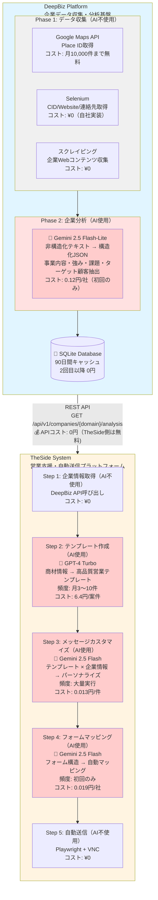
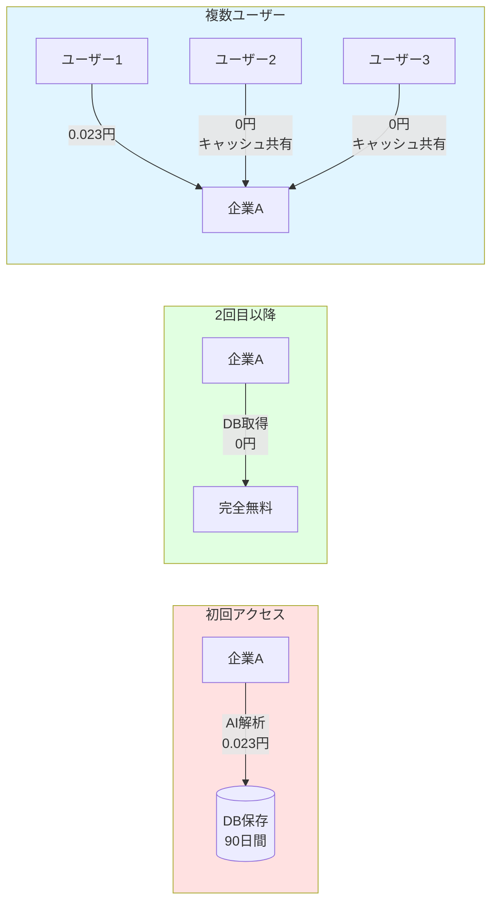
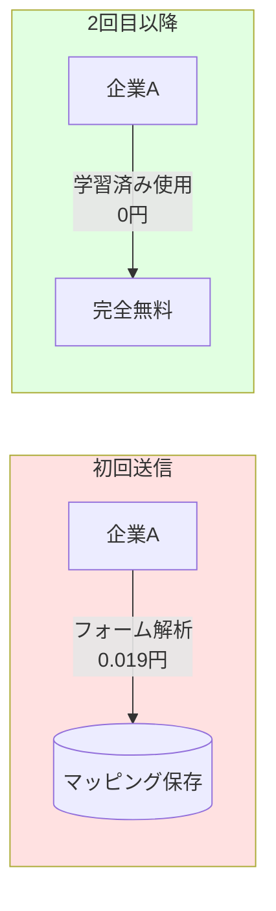

# DeepBiz × TheSide 統合AIコスト戦略

**最終更新**: 2026-01-01  
**バージョン**: 1.0  
**対象読者**: 経営者、プロダクトマネージャー

---

## 📋 目次

1. [統合システム概要](#統合システム概要)
2. [AI使用箇所とコスト比較](#ai使用箇所とコスト比較)
3. [統合運用コストシミュレーション](#統合運用コストシミュレーション)
4. [コスト設計戦略](#コスト設計戦略)

---

## 🎯 統合システム概要

### システム連携フロー



---

## 🤖 AI使用箇所とコスト比較

### AIコスト発生箇所マトリックス

| システム | ステップ | AIモデル | 単価 | 頻度 |
|---------|---------|---------|------|------|
| **DeepBiz** | 企業分析 | **Gemini 2.5 Flash-Lite** | **0.12円/社** | 初回のみ |
| **DeepBiz** | データ収集 | AI不使用 | ¥0 | 毎回 |
| **TheSide** | 企業情報取得 | AI不使用 | ¥0 | 毎回 |
| **TheSide** | テンプレート作成 | **GPT-4 Turbo** | **6.4円/案件** | 案件ごと |
| **TheSide** | カスタマイズ | **Gemini 2.5 Flash** | **0.013円/件** | 送信ごと |
| **TheSide** | フォームマッピング | **Gemini 2.5 Flash** | **0.019円/社** | 初回のみ |
| **TheSide** | 自動送信 | AI不使用 | ¥0 | 毎回 |

### AIモデル選定理由

| AIモデル | 使用箇所 | 単価 | 選定理由 |
|---------|---------|------|---------|
| **Gemini 2.5 Flash-Lite** | DeepBiz: 企業分析 | 0.12円/社 | 最安コスト + 高速処理 + 高精度（2026年最新モデル） |
| **GPT-4 Turbo** | TheSide: テンプレート作成 | 6.4円/案件 | 高品質テンプレートで成約率向上 |
| **Gemini 2.5 Flash** | TheSide: カスタマイズ・マッピング | 0.013〜0.019円 | 大量実行でコスト最適化 |

### 他AIモデルとのコスト比較（DeepBiz企業分析の場合）

| AI モデル | 1社コスト | Gemini 2.5 Flash-Liteとの差 |
|----------|----------|---------------------------|
| GPT-4o | 3.04円 | **25倍高い** |
| Claude 3.5 Haiku | 1.06円 | 8.8倍高い |
| GPT-4o mini | 0.19円 | 1.5倍高い |
| **Gemini 2.5 Flash-Lite** | **0.12円** | ✅ **最安** |

**結論**: DeepBizでは最安のGemini 2.5 Flash-Liteを選定し、データ基盤のコストを最小化

---

## 💰 統合運用コストシミュレーション

### シナリオ別統合コスト（月額）

#### 🔹 シナリオ1: スタートアップ（月3万件）

**規模**: 企業数 10,000社 / 案件数 3 / 月間送信 30,000件

| 項目 | 金額 |
|------|------|
| **DeepBiz AI**（企業分析） | 230円 |
| **DeepBiz VPS**（4G） | 3,227円 |
| **TheSide AI**（テンプレート） | 19円 |
| **TheSide AI**（カスタマイズ） | 390円 |
| **TheSide AI**（マッピング） | 190円 |
| **TheSide VPS**（4G） | 3,429円 |
| **🔥 月額合計** | **7,485円** |
| **年額** | 89,820円 |
| **1件単価** | 0.250円 |

**コスト構成**: AI 829円（11.1%） / インフラ 6,656円（88.9%）

---

#### 🔹 シナリオ2: 本格運用（月6万件）【推奨】

**規模**: 企業数 20,000社 / 案件数 3 / 月間送信 60,000件

| 項目 | 金額 |
|------|------|
| **DeepBiz AI**（企業分析） | 460円 |
| **DeepBiz VPS**（4G） | 3,227円 |
| **TheSide AI**（テンプレート） | 19円 |
| **TheSide AI**（カスタマイズ） | 780円 |
| **TheSide AI**（マッピング） | 380円 |
| **TheSide VPS**（8G） | 6,857円 |
| **🔥 月額合計** | **11,723円** |
| **年額** | 140,676円 |
| **1件単価** | 0.195円 |

**コスト構成**: AI 1,639円（14.0%） / インフラ 10,084円（86.0%）

---

#### 🔹 シナリオ3: 大規模展開（月15万件）

**規模**: 企業数 50,000社 / 案件数 3 / 月間送信 150,000件

| 項目 | 金額 |
|------|------|
| **DeepBiz AI**（企業分析） | 1,150円 |
| **DeepBiz VPS**（4G） | 3,227円 |
| **TheSide AI**（テンプレート） | 19円 |
| **TheSide AI**（カスタマイズ） | 1,950円 |
| **TheSide AI**（マッピング） | 950円 |
| **TheSide VPS**（16G） | 13,109円 |
| **🔥 月額合計** | **20,405円** |
| **年額** | 244,860円 |
| **1件単価** | 0.136円 |

**コスト構成**: AI 4,069円（19.9%） / インフラ 16,336円（80.1%）

---

### 📊 スケール効率比較

| 項目 | シナリオ1<br>3万件 | シナリオ2<br>6万件<br>【推奨】 | シナリオ3<br>15万件 |
|------|------------------|---------------------------|-------------------|
| **月額合計** | 7,485円 | 11,723円 | 20,405円 |
| **1件単価** | 0.250円 | 0.195円 | 0.136円 |
| **単価削減率** | - | **▼22.0%** | **▼45.6%** |
| **AI比率** | 11.1% | 14.0% | 19.9% |
| **インフラ比率** | 88.9% | 86.0% | 80.1% |

**💡 スケールメリット**:
- 規模拡大により1件単価が最大45.6%削減
- AI比率が増加（11.1% → 19.9%）= 処理能力の証
- インフラは固定費なので、処理量増加で効率向上

---

## 🎯 コスト設計戦略

### 1. **役割分担によるコスト最適化**

| システム | 役割 | AIコスト | 戦略 |
|---------|------|---------|------|
| **DeepBiz** | データ基盤 | 0.023円/社（初回のみ） | **最安AI + 90日キャッシュで実質コスト削減** |
| **TheSide** | 営業実行 | 6.4円/案件 + 0.013円/件 | **高品質AI（GPT-4）と低コストAI（Gemini）のハイブリッド** |

**効果**: 各システムが得意領域に特化し、全体コストを最小化

---

### 2. **キャッシュ戦略によるコスト削減**

#### DeepBiz: 企業分析キャッシュ（90日間）



**効果**: 
- 2回目以降のアクセス: 100%コスト削減
- 複数ユーザー: 実質コスト = 0.023円 ÷ ユーザー数

#### TheSide: フォームマッピング学習



**効果**: 継続利用でフォームマッピングコストが実質0円に

---

### 3. **AI選定の最適化**

#### DeepBiz: Gemini 2.0 Flash（最安）

```
企業分析（5,910トークン）:
├─ Gemini 2.0 Flash: 0.023円
├─ Claude 3 Haiku: 0.13円（6倍高い）
├─ GPT-3.5 Turbo: 1.4円（61倍高い）
└─ GPT-4: 63円（2,739倍高い）

✅ 選定理由: データ基盤は大量処理が必要 → 最安AI必須
```

#### TheSide: GPT-4 + Gemini ハイブリッド

```
【高頻度・低コスト処理】
カスタマイズ（月30,000〜150,000件）:
└─ Gemini 2.5 Flash: 0.013円/件

【低頻度・高品質処理】
テンプレート作成（月3〜10件）:
└─ GPT-4 Turbo: 6.4円/案件

✅ 選定理由: 
   - 大量実行はGeminiでコスト最適化
   - テンプレートはGPT-4で品質確保（月19円の差で成約率向上）
```

---

### 4. **段階的スケール戦略**

| フェーズ | 規模 | システム構成 | 月額コスト | 戦略 |
|---------|------|------------|-----------|------|
| **Phase 1<br>検証** | 1万社<br>3万件 | DeepBiz 4G<br>TheSide 4G | 7,485円 | 小規模でPMF検証 |
| **Phase 2<br>成長** | 2万社<br>6万件 | DeepBiz 4G<br>TheSide 8G | 11,723円 | 本格運用開始 |
| **Phase 3<br>拡大** | 5万社<br>15万件 | DeepBiz 4G<br>TheSide 16G | 20,405円 | スケール効果発揮<br>（1件単価▼45.6%） |

**ポイント**: DeepBizはデータ基盤なので4Gで固定、TheSideのみスケールアップ

---

### 5. **コスト構成の透明性**

#### 月6万件（推奨構成）の詳細内訳

```
【AIコスト: 1,639円（14.0%）】
├─ DeepBiz企業分析: 460円（28.1%）
├─ TheSideカスタマイズ: 780円（47.6%）← 最大
├─ TheSideテンプレート: 19円（1.2%）
└─ TheSideマッピング: 380円（23.2%）

【インフラコスト: 10,084円（86.0%）】
├─ DeepBiz VPS: 3,227円（32.0%）
└─ TheSide VPS: 6,857円（68.0%）← 最大

💡 インフラが86%を占める
   → AIコストは予測可能で管理しやすい
   → スケール時もAIコスト比率は20%以下
```

---

## 📈 統合システムのビジネス価値

### 1. **データ基盤の効率化（DeepBiz）**
- 企業分析: 10分 → 2秒（300倍高速化）
- コスト: 0.023円/社（業界最安レベル）
- キャッシュ: 90日間無料再利用

### 2. **営業効率の最大化（TheSide）**
- パーソナライズ文面: 自動生成
- フォーム送信: 完全自動化
- コスト: 0.013円/件（大量実行可能）

### 3. **統合による相乗効果**
- DeepBizのデータをTheSideで活用 → データ基盤の投資効果最大化
- 両システムで最適なAI選定 → 全体コスト最小化
- 段階的スケール → リスク低減と効率向上

---

## 🚀 まとめ

### コスト設計の3原則

1. **役割分担**: DeepBiz（データ基盤） + TheSide（営業実行）
2. **AI最適化**: 用途別に最適なAIモデルを選定
3. **スケール効率**: 規模拡大で1件単価を最大45.6%削減

### 推奨構成（月6万件）

- **月額**: 11,723円
- **1件単価**: 0.195円
- **AI比率**: 14.0%（予測可能）
- **年額**: 140,676円

**原価を戦略的且つ効率的に設計した統合プラットフォーム**

---

**作成日**: 2026-01-01  
**バージョン**: 1.0  
**関連ドキュメント**:
- [DeepBiz_System_AI_Strategy.md](./DeepBiz_System_AI_Strategy.md)
- [TheSide_System_AI_Strategy.md](./TheSide_System_AI_Strategy.md)
